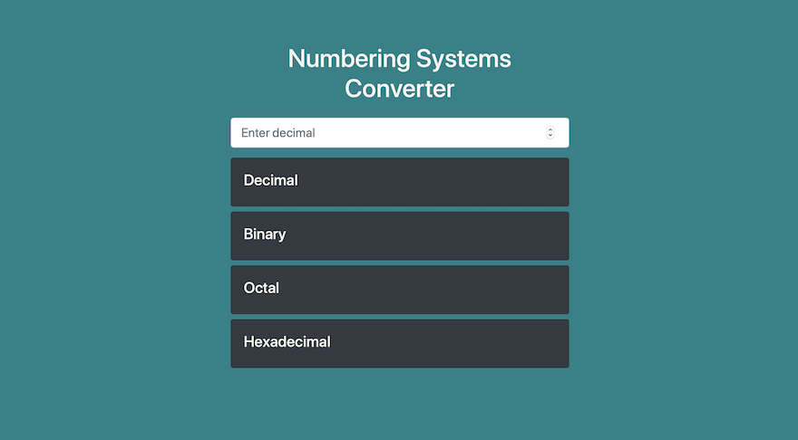

# README

## Bootstrap Numbering Systems Converter

This is a simple front-end project, implemented with Bootstrap 4 U, which is elegant and easy to use. It converts a decimal number input to binary, octal and hexadecimal.

### Project Status

This project is currently in development. Users can enter a decimal number and see converted values in the other numbering systems immediately. Functionality for more types of conversion, handling fractions and possibly the complement system calculations are in progress. A more visually appealing design is also being contemplated.

### Project Screenshots

### Installation and Setup

None.

### Reflection

This was a quick, 1 hour project done following the [Traversy Media Simple Weight Converter App with JavaScript and Bootstrap 4](https://www.youtube.com/watch?v=7l-ZAuU8TXc) YouTube tutorial to practice JS and bootstrap.

This was done as a warm up exercise to get myself accustomed to my windows developer environment, and to remind myself of what I learned about Bootstrap a while ago.

I'd just finished ITI1100 Digital Systems. When I was practicing homework, I wanted to use a online calculator to check if I'd done the conversions right manually. However, .com options all looked quite terrible and were riddled with ads. I've created this hoping it will soon become a useful little tool for myself.

